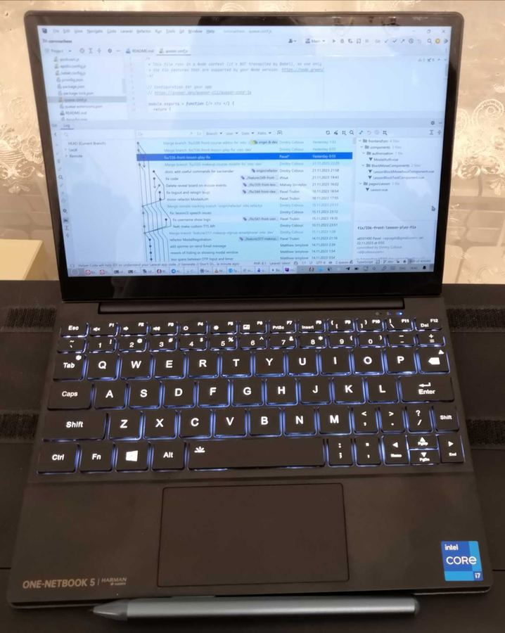
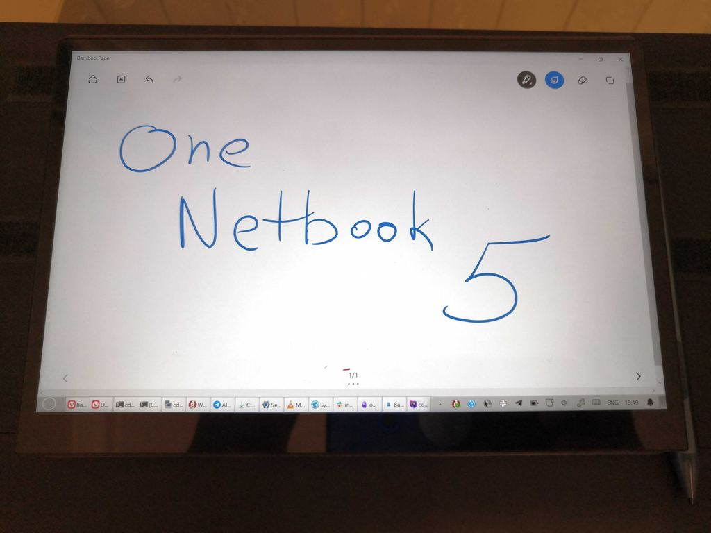

# Обзор микро-ноутбука One Netbook Onemix 5
Хочу поделиться открытием 2023 года. Это компьютер в категории [Subnotebook](https://en.wikipedia.org/wiki/Subnotebook), то есть ноутбук размером меньше, чем обычный. По мощности его можно отнести к категории [Ultrabook](https://en.wikipedia.org/wiki/Ultrabook).

## Преамбула
Мне не хватало мелкого и лёгкого ноутбука, который бы можно было взять с собой “с оказией” хоть куда. То есть в поездку на уик-энд, в отпуск, на дачу, ~~в сортир~~.
Обычно всем для этих целей хватает стандартного ноутбука или телефона/планшета, но для целей “мимоходом схватить и сунуть в карман” даже небольшой 13" ноутбук оказывается слишком большой и тяжёлый, а устройства на мобильных ОС меня давно выбешивают своей неполноценностью, где в бравзере нет DevTools, открытые страницы (и приложения) постоянно выгружаются, нет элементарного docker, и интерфейс приложений заточен под мелкие экраны.
## С чем сравнивал?
- 12” Lenovo Thinkpad X230. Классика ноутбуко-строения, великолепная клавиатура и тачпад со средней кнопкой (!), лампочка подсветки в крышке экрана. Почему нет? Большой и тяжёлый.
- 7” GPD Pocket. Китайское инженерное чудо, работающее на Windows 10 или на Ubuntu Mate. Некоторые телефоны по размерам больше. Лезет в карман. Почему нет? Всё-таки экран маловат, и клавиши из-за такого малого размера, скученны и всё через Fn.
- Другие ноутбуки меньше 14” всё равно слишком большие. Apple Macbook Air это аж целых 13.6”. Меньше – уже будет не очень удобно для ежедневной работы, поэтому таких ноутбуков почти нет.

## Открытие
Внезапно, как и в случае с GPD, открыл для себя никому не известную за пределами Китая марку электроники “[One Netbook](https://onexplayerstore.com/collections/one-netbook)”, они же “[One Xplayer](https://onexplayerstore.com)”. Также как и GPD, они специализируются на игровых карманных компах, но иногда ~~по приколу~~ выпускают рабочие ноутбуки. Компания не однодневка, у них есть отлаженный процесс качественного производства.
Эту модель они выпустили весной 2023 под названием OneMix 5, и потом внесли небольшие изменения и сократили название до просто “5” и эту модель стали продавать за пределами Китая.
## Где брал?
На Алике, [вот ссылка](https://aliexpress.ru/item/1005002204494911.html?spm=a2g2w.orderdetail.0.0.33b04aa6KueQsO&sku_id=12000029679283604). Это официальный магазин производителя. Ждал долго, но вероятно из-за ажиотажа 11.11. Всё пришло в лучшем виде, хотя уголки коробки чуть-чуть замялись, шутка ли – посылка ехала через весь мир из Китая в Москву, а потом обратно в Сибирь.
## Что там интересного?
Мелкий и лёгкий (вес 1кг). Лезет либо в карман горнолыжной куртки (там внутри бывают большие карманы для крупных вещей), либо в любую сумочку.
Внешняя часть корпуса выполнена из натуральной кожи, то есть это не чехол, как могло показаться из официальных фото. Я заказывал вместе с отдельным фирменным чехлом, он сделан из жёсткой синтетики, которую не жалко повредить, в отличие от кожи.
Также кроме чехла, можно заказать слилус. Он имеет чувствительность к нажатию, плюс 2 клавиши, одна имитирует правую кнопку мыши, а вторая отдельную команду, в разных приложениях совершает своё действие. Внутри стилуса аккумулятор, и разъём USB Type C, заряжается от ноутбучной зарядки. Стилус подходит к другим Windows-устройствам с поддержкой стилусов. Насколько я понял, это такой стандарт для всех активных стилусов – [USI](https://www.howtogeek.com/835769/active-vs-passive-styluses-all-the-standards-explained/). Стилус примагничивается к торцу ноутбука, как в Айпаде.
Экран необычным образом поворачивается на 180 градусов по горизонтальной оси, но не в петлях, как [Lenovo Yoga](https://www.lenovo.com/us/en/p/laptops/yoga/yoga-2-in-1-series/yoga-6-gen-8-(13-inch-amd)/len101y0027), а по отдельному “излому” по центру крышки. Это позволяет сложить его так, чтобы клавиатура закрылась экраном, и держать его как планшет. Держать в таком положении вполне удобно, можно взяться пальцами только за клавиатурную часть, чтобы случайно не нажать что-нибудь на экране. Также есть промежуточное положение экрана, когда нижняя кромка стоит между клавиатурой и тачпадом, но я не нашёл для этого практического применения. Все три положения фиксируются магнитами.
Экран тачевый, поддерживает несколько касаний, зум в картах делается также удобно, как на мобильном планшете. Есть экранные жесты двумя и тремя пальцами. Сам экран глянцевый. Яркость достаточная, но при работе в темноте недостаточно плавно регулируются тусклые режимы, но не смертельно. Разрешение 2560x1600, размер 10.1 дюймов, картинка не хуже любых “а-ля Ретина” экранов. Есть датчик поворота, как на телефоне, но в отличие от телефона, поворачивается на все 4 стороны, а не на 3.
Тачпад тоже поддерживает зум и прочие современные жесты.
Стилусом можно рисовать, кладя руку на экран. Если поднести кончик к экрану, то появится стилусовый курсор, после чего прикосновения руки не будут расцениваться как “клики”, и рука может лежать на экране. Это наиболее удобное положение, но когда экран находится в позиции “ноутбук”, то есть вертикально, то рисовать на нём неудобно, т.к. рука висит в воздухе. Получается что все ноутбуки со стайлусами не годятся для рисования, исключения это те, где экран можно положить горизонтально, этот ноутбук как раз такой. Например в [Asus Pro Duo](https://www.asus.com/us/laptops/for-creators/zenbook/zenbook-pro-duo-15-oled-ux582-12th-gen-intel/) нижний экран удобен для рисования, верхний – нет.
На клавиатуре есть необычные Fn-комбинации: запустить вентиляторы на полную мощность, и наоборот, принудительно выключить или оставить на минимуме, пусть с тротлингом.
Процессор Intel Core i7 1250U, там 2 мощных ядра с гипертредом плюс 8 “дохлых” ядер для низкого потребления энергии, итого 12 логических ядер. Видеокарта Iris Xe встроена в процессор.
Оперативы 32Гб, хватает для работы, можно одновременно запустить бравзер (со 100 табами), фигму, WSL, постман, IDE, слак и любое толстое приложение, и всё поместится.
Диск SSD 1Тб nvme (можно заказать 2Тб), не тормознее любого современного SSD.
Есть 2 динамика, звук не хуже чем на качественных планшетах Samsung или Huawei.
Есть микрофон, звёзд с неба не хватает, но речь слышно отчётливо, хрипов нет.
Блютуз и вайфай работают без проблем.
Есть 2 порта USB Type C, но один USB4, а другой USB3. Есть Thunderbolt, можно подключить дисплей.
Есть выход на наушники/гарнитуру.
Есть слот для MicroSD.
В кнопку включения встроен датчик отпечатка. Реагирует моментально.
Винда обычная английская. Китайские иероглифы видел только в списке установленных шрифтов. Диск поделён на C: и D: пополам по 500Гб
Батарея держит весь день, если тупить в бравзере, и полдня если работать на полную.
## Недостатки
Клавиатура таких размеров конечно же с компромиссами (но лучше чем на 7-дюймовом GPD). Функционалки от F1 до F8 нажимаются сразу, а от F9 до F12 через Fn, потому что без Fn там управляющие клавиши. Правого Ctrl нет (в Far Manager RCtrl+number это переход по Folder Bookmarks).
Русские буквы на клавишах не нарисованы, надо гравировать или брать наклейки. Принцип “я помню каждую клавишу наизусть” тут не работает – буквы х,ъ,ж,э располагаются не там, где обычно.
Кнопка включения (датчик отпечатка) сделана заподлицо с корпусом и нащупать её не получится, я ставлю палец на глаз “чуть ниже шифта”.
Из спячки выходит не также моментально как современные ноутбуки Apple, Asus. Я насчитал 5 секунд. Не смертельно.
Большого USB Type A нет. Для старого USB-барахла потребуется хаб с Type C.
Оператива распаяна, не заменить. Хотя куда уж больше для такой крохи.
Камеры нет. Кому-то может быть важно.
Матрица IPS неплохого качества, но если привыкли к OLED, то эти самые засветы на чёрном будете замечать. Но засветка равномерная, без пятен. Не смертельно.
Стилус тёмного небесно-голубого цвета, не совпадает с чёрным цветом ноутбука.
Не хочет заряжаться от зарядок Huawei/Honor и от ноутбука GPD, надо заранее иметь в виду и брать с собой родную зарядку или подобрать совместимую.
Вес 1кг не позволяет держать его расслабленно двумя пальцами, как планшет весом с пушинку. А чего вы хотели-то? [46 тонн!](https://pikabu.ru/story/anekdot_291357)
## Что удивило
Качество сборки не хуже лучших образцов Apple и прочих некитайских марок, а также полу-китайского Asus.
Материалы тоже на высоте. Выбор натуральной кожи для внешней облицовки корпуса это такой нормальный китайский дизайн, в лучшем смысле слова “китайский”. На чёрной коже в углу небольшой круглый чёрный логотип компании “One”, стильно.
## Итого
Подойдёт не всем.
Идеально – если в разъездах нужен полноценный софт, но постоянно таскать с собой тяжёлый рюкзак надоедает.
Серфить интернеты, подключив большой монитор и клаву – избыточно, лучше за эти деньги взять десктоп.
Дома на диване – лучше большой ноутбук.